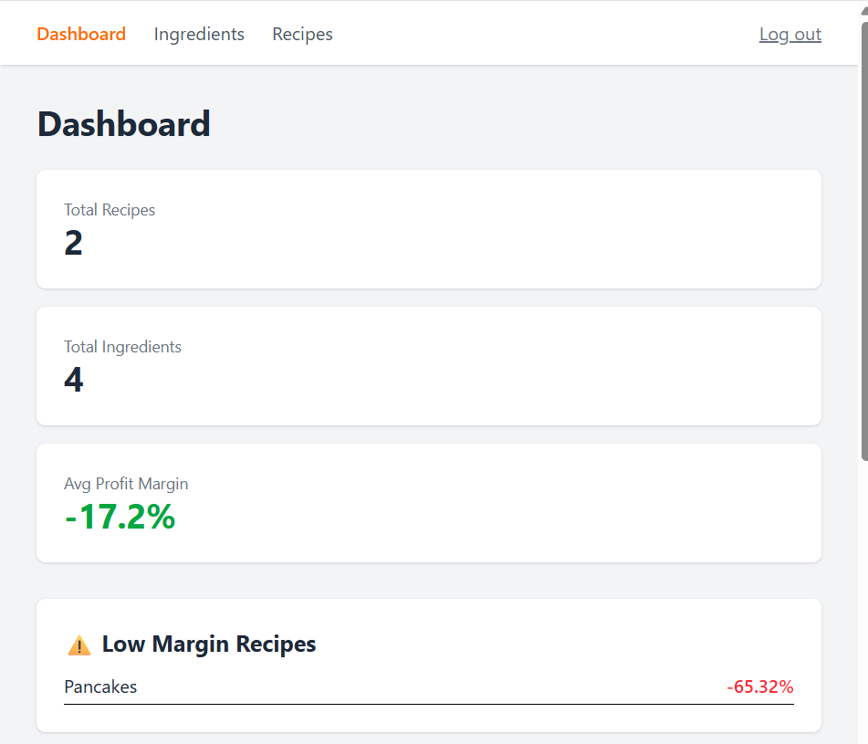
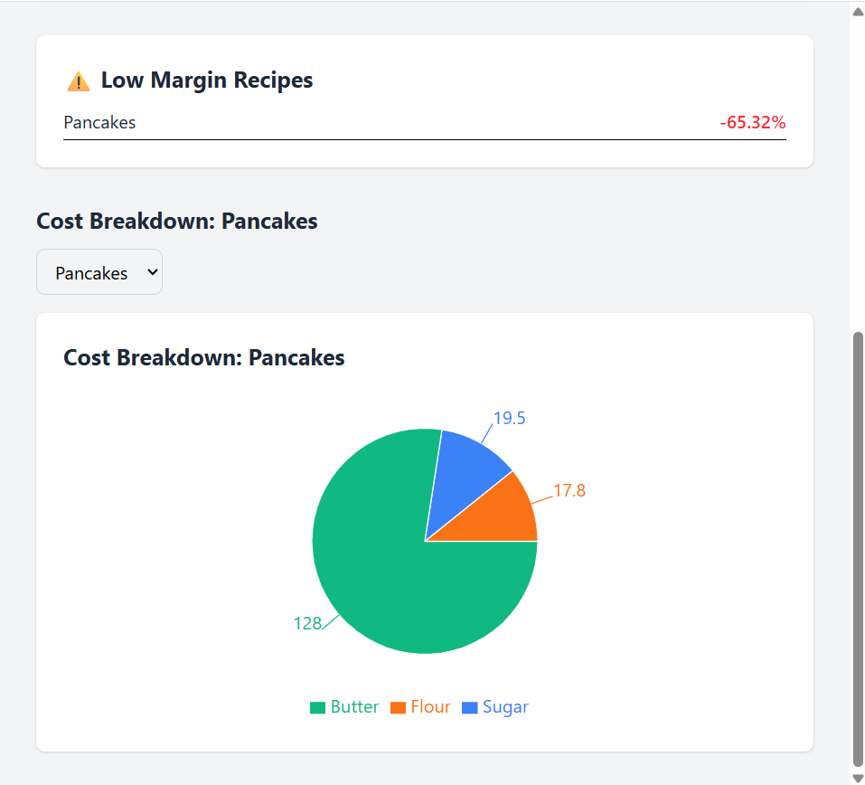
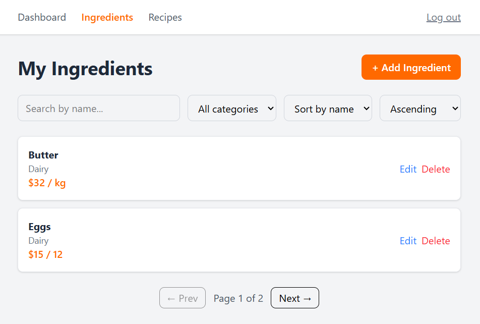
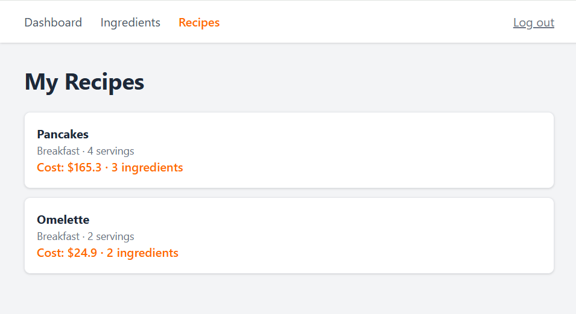

# Recipe Cost Calculator — Frontend

A React + TypeScript frontend for the [Recipe Cost Calculator API](https://github.com/Elad255/recipe-cost-calculator). Restaurant owners can manage ingredients, build recipes, and see live cost and profit-margin calculations — the complete product on top of a backend I also built.

## What it does

- 🔐 **Authentication** — register, log in, and stay logged in across refreshes (JWT)
- 🥚 **Ingredient management** — full create/read/update/delete with search, filter, sort, and pagination
- 🍳 **Recipe builder** — add ingredients with quantities and watch costs recalculate live
- 📊 **Dashboard** — summary stats, low-margin warnings, and a cost-breakdown chart
- ✨ **Polished UX** — loading skeletons, toast notifications, responsive design

## Tech stack

- **React 19** + **TypeScript** (Vite)
- **Tailwind CSS** for styling
- **React Router** for navigation
- **Axios** for API calls (with auth interceptor)
- **Recharts** for data visualization
- **Docker** + **nginx** for production builds

## Screenshots

## Running it

The whole stack (frontend + backend + database) runs with one command from the backend repo:

\`\`\`bash
docker compose up --build
\`\`\`

Then open http://localhost:5173

## The story

I built this frontend on top of a FastAPI backend I developed myself — so this project is the complete product, front to back. My background as a professional cook is what inspired the Recipe Cost Calculator: it's the tool I wish I'd had in the kitchen.
